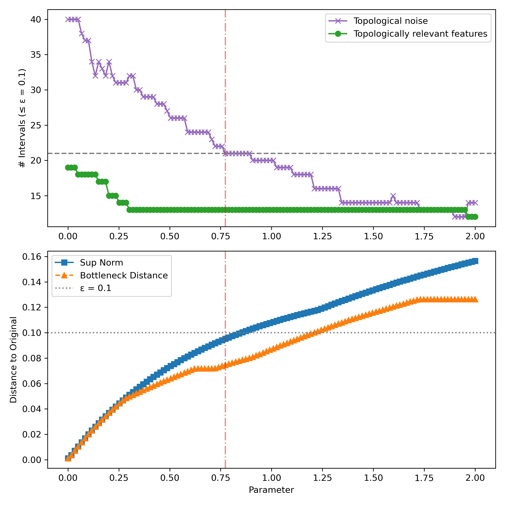
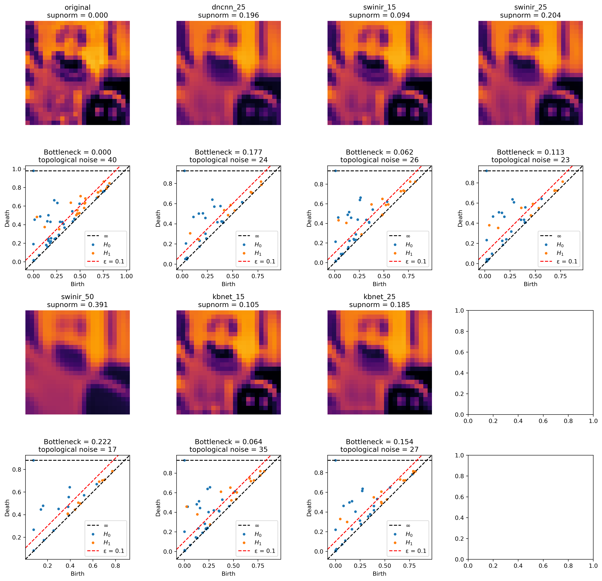
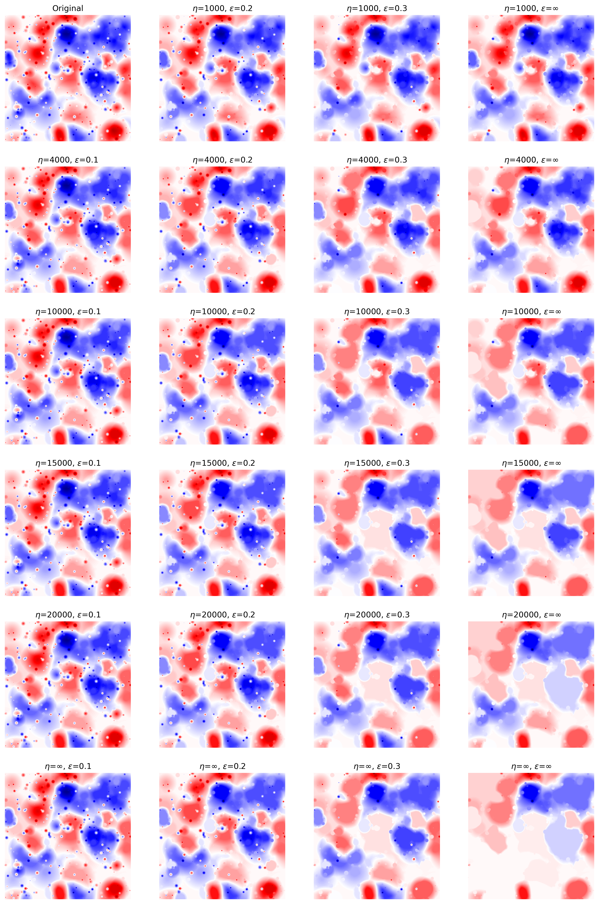
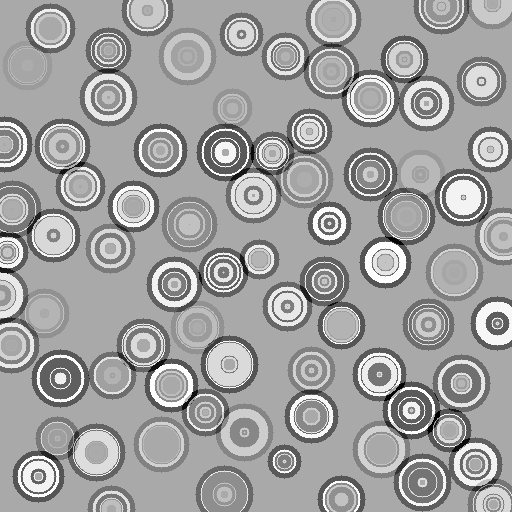
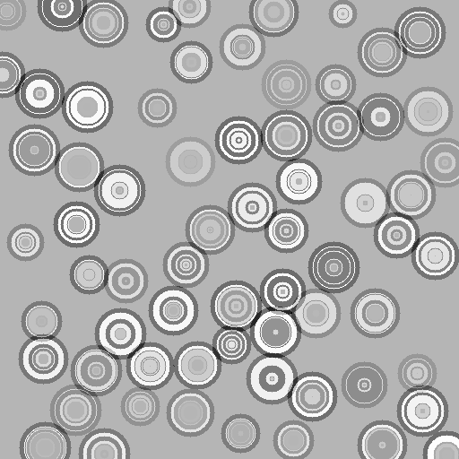
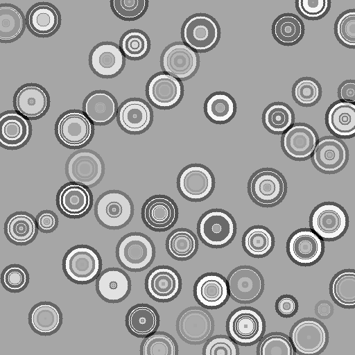
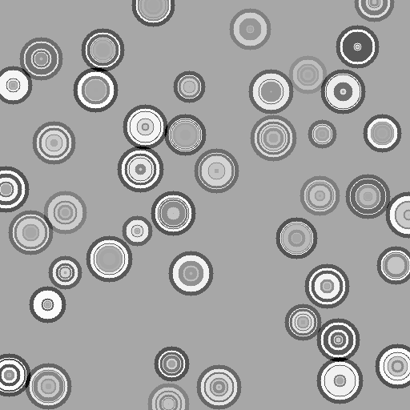
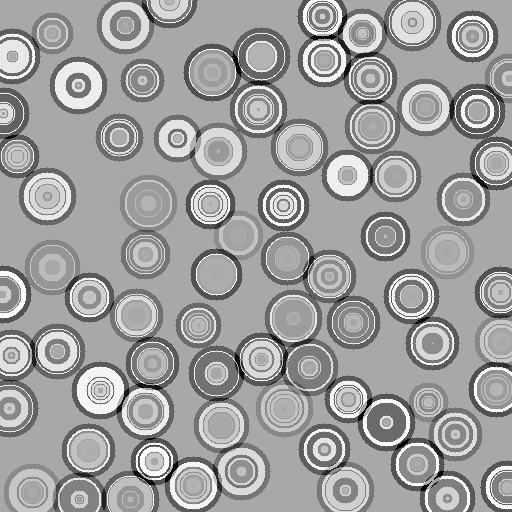

# Topological Filtering of Graph Signals: Persistence-Based Methods and Applications

This repository contains supplementary materials for my PhD thesis titled *Topological Filtering of Graph Signals: Persistence-Based Methods and Applications*.

The complete thesis is available [here](./thesis.pdf).

**THESIS ABSTRACT:** Topological methods have emerged as powerful tools in modern data analysis, providing robust frameworks for capturing the shape and structure of complex datasets. Among these, *persistent homology* has become particularly influential, as it quantifies topological features across multiple scales and distinguishes meaningful structure from noise through the notion of persistence.

Building on this foundation, we formalize the concept of *topological noise* as low-persistence features—those that arise from small perturbations in signal values. This thesis addresses the challenge of filtering such noise from real-valued signals defined on graphs and higher-order structures, with the objective of preserving topologically significant features while maintaining fidelity to the original signal.

We begin by demonstrating that conventional graph signal processing methods, including spectral filters and deep learning-based denoising techniques, are inadequate for removing topological noise without introducing significant distortion to either the signal or its topologically meaningful features. To address this shortcoming, we formalize the problem of persistence-aware filtering under strict structural constraints and show that, in general, no exact solution exists when attempting to simultaneously filter features across multiple homological dimensions. This result highlights a fundamental trade-off between denoising and topological fidelity in multi-dimensional settings.

To overcome this challenge, we propose a relaxed formulation and introduce a data structure—the *Basin Hierarchy Tree*—which encodes persistence information hierarchically and supports efficient, topology-aware filtering. Building on this structure, we develop the *Low Persistence Filter*, a method that selectively removes low-persistence features while preserving high-persistence structures within a controlled approximation bound. The method is first formulated for graph signals and then extended to graphs with faces, enabling the simultaneous filtering of 0- and 1-dimensional features. Theoretical guarantees are established, and our main result ensures topological fidelity under explicitly defined tolerances.

We validate our approach by implementing the filter in an open-source software and by applying it to a series of illustrative examples. Additionally, we extend the filtering framework to incorporate size-based criteria and define summary statistics derived from the Basin Hierarchy Tree. In a synthetic classification task, these statistics outperform traditional persistent homology-based features and even exceed the accuracy of state-of-the-art deep learning models. Collectively, this work advances both the theory and practice of topological signal processing, offering scalable tools for persistence-guided filtering.

  
## Spectral Filtering

The spectral filtering and digital signal processing denoising experiments can be reproduced using the notebook [`spectral_filtering.ipynb`](./Spectral_filtering/spectral_filtering.ipynb).

Below is an example figure from that section, showing the behavior of topological noise under the heat kernel (low-pass filter).  
- **Top row**: Topological noise (purple) and topologically relevant features (green) plotted against the scale parameter.  
- **Bottom row**: Sup-norm (blue) and bottleneck distance (orange) as functions of the same parameter.

  
Deep learning-based denoising experiments are provided in [`deepmodels_filtering.ipynb`](./Spectral_filtering/Filtering_with_Deep_Models/deepmodels_filtering.ipynb). The following image shows results across various models:

  
## Size-Aware Low Persistence Filtering

All related experiments are presented in [`size_aware_filtering.ipynb`](./Size_Aware_Filtering/size_aware_filtering.ipynb). The image below demonstrates filtering based on both persistence and size across multiple thresholds:

  
## BHT Summary Statistics

The binary classification experiment using BHT summary statistics can be found in [`BHT_summary_statistics.ipynb`](./BHT_summary_statistics/BHT_summary_statistics.ipynb).  
Training of ResNet18 and ResNet50 for this task is documented in [`Deep_model.ipynb`](./BHT_summary_statistics/Deep_model.ipynb).

<table>
  <tr>
    <td align="center">
       
      Label 1
    </td>
    <td align="center">
       
      Label 1
    </td>
    <td align="center">
       
      Label 1
    </td>
  </tr>
  <tr>
    <td align="center">
       
      Label 2
    </td>
    <td align="center">
       
      Label 2
    </td>
    <td align="center">
       
      Label 2
    </td>
  </tr>
</table>
